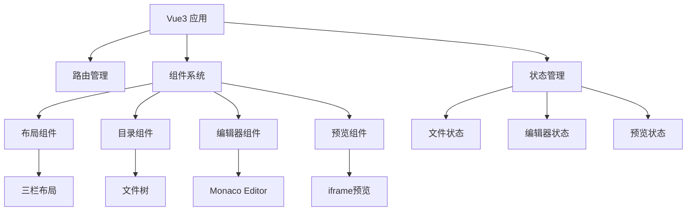
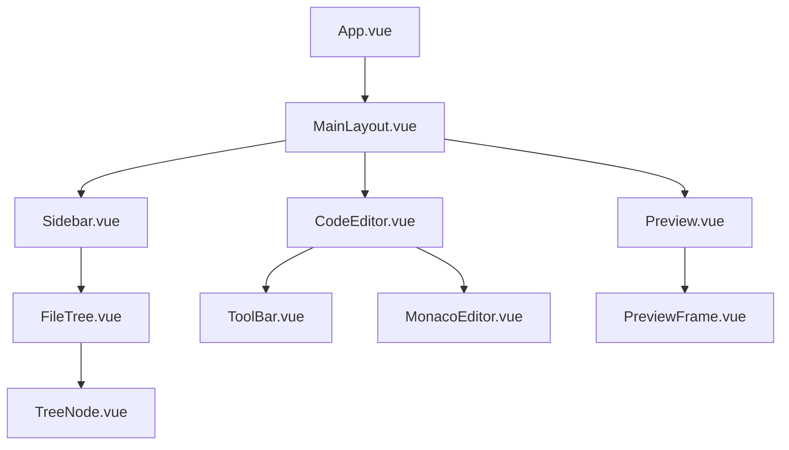
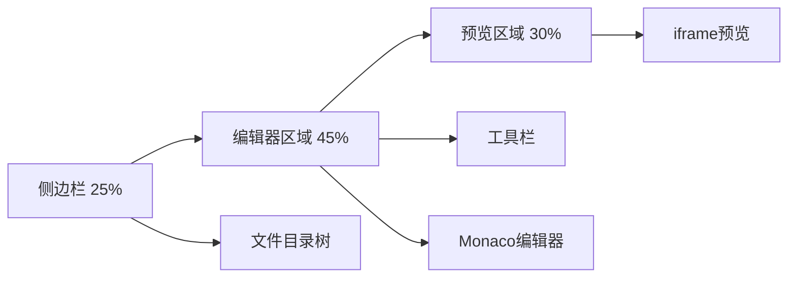
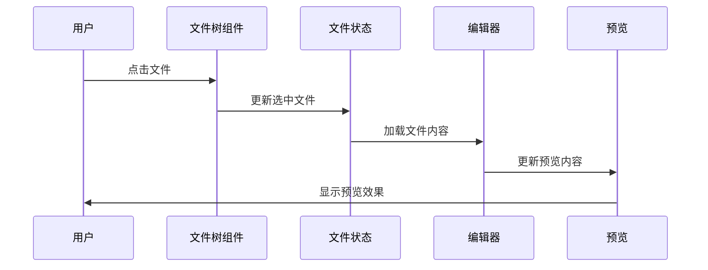
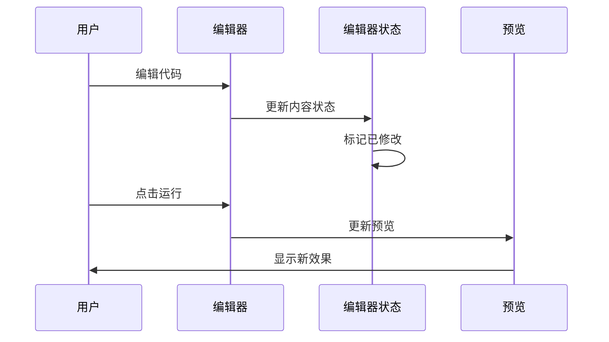

# 代码示例展示网站设计文档

## 1. 项目概述

### 1.1 项目背景
开发一个基于Vue3的代码示例展示网站，用于展示和演示各种HTML代码示例。用户可以浏览代码、实时编辑、复制和预览效果。

### 1.2 核心功能
- 读取本地HTML文件并展示为目录结构
- 左侧目录导航，支持切换不同代码示例
- 中间代码编辑器，支持实时编辑
- 右侧效果预览，支持实时预览
- 代码复制和运行功能

### 1.3 技术栈
- **前端框架**: Vue 3.x + Composition API
- **类型支持**: TypeScript
- **UI组件库**: Element-Plus
- **代码编辑器**: Monaco Editor (VS Code编辑器内核)
- **构建工具**: Vite
- **包管理器**: pnpm

## 2. 技术架构

### 2.1 整体架构图



### 2.2 目录结构

```
src/
├── components/           # 业务组件
│   ├── Layout/          # 布局组件
│   │   ├── MainLayout.vue
│   │   └── Sidebar.vue
│   ├── FileTree/        # 文件目录组件
│   │   ├── FileTree.vue
│   │   └── TreeNode.vue
│   ├── CodeEditor/      # 代码编辑器组件
│   │   ├── MonacoEditor.vue
│   │   └── ToolBar.vue
│   └── Preview/         # 预览组件
│       ├── CodePreview.vue
│       └── PreviewFrame.vue
├── composables/         # 组合式函数
│   ├── useFileSystem.ts # 文件系统相关
│   ├── useCodeEditor.ts # 编辑器相关
│   └── usePreview.ts    # 预览相关
├── stores/              # 状态管理
│   ├── files.ts         # 文件状态
│   ├── editor.ts        # 编辑器状态
│   └── preview.ts       # 预览状态
├── types/               # 类型定义
│   ├── file.ts
│   ├── editor.ts
│   └── preview.ts
├── utils/               # 工具函数
│   ├── fileUtils.ts     # 文件处理
│   ├── codeUtils.ts     # 代码处理
│   └── previewUtils.ts  # 预览处理
└── assets/              # 静态资源
    └── icons/
```

## 3. 组件架构

### 3.1 主要组件层次结构



### 3.2 组件功能说明

#### MainLayout.vue - 主布局组件
```typescript
interface LayoutProps {
  sidebarWidth: number;
  editorWidth: number;
  previewWidth: number;
}

// 响应式布局管理
// 拖拽调整面板大小
// 整体布局结构
```

#### FileTree.vue - 文件目录组件
```typescript
interface FileNode {
  id: string;
  name: string;
  type: 'file' | 'folder';
  path: string;
  children?: FileNode[];
  isExpanded?: boolean;
}

// 递归渲染文件树
// 文件选择和切换
// 目录展开/折叠
```

#### MonacoEditor.vue - 代码编辑器组件
```typescript
interface EditorProps {
  value: string;
  language: string;
  theme: string;
  readonly: boolean;
}

// Monaco Editor集成
// 语法高亮
// 实时编辑
// 快捷键支持
```

#### PreviewFrame.vue - 预览组件
```typescript
interface PreviewProps {
  htmlContent: string;
  autoRefresh: boolean;
}

// iframe沙箱预览
// 实时刷新
// 错误处理
```

## 4. 状态管理

### 4.1 Pinia Store 设计

#### 文件状态管理 (files.ts)
```typescript
interface FileState {
  fileList: FileNode[];
  currentFile: FileNode | null;
  selectedFileId: string | null;
  isLoading: boolean;
}

// 文件加载
// 文件选择
// 文件切换
```

#### 编辑器状态管理 (editor.ts)
```typescript
interface EditorState {
  content: string;
  originalContent: string;
  isModified: boolean;
  cursorPosition: number;
  selectedText: string;
}

// 内容编辑
// 修改状态跟踪
// 光标位置管理
```

#### 预览状态管理 (preview.ts)
```typescript
interface PreviewState {
  previewContent: string;
  isAutoRefresh: boolean;
  previewError: string | null;
}

// 预览内容管理
// 自动刷新控制
// 错误状态处理
```

## 5. 核心功能实现

### 5.1 文件系统集成

#### 文件读取方案
```typescript
// 使用 File System Access API (现代浏览器)
async function readLocalFiles(): Promise<FileNode[]> {
  const dirHandle = await window.showDirectoryPicker();
  return await traverseDirectory(dirHandle);
}

// 降级方案：文件上传
function fallbackFileUpload(): Promise<FileNode[]> {
  // input[type="file"] webkitdirectory
}
```

#### 文件树构建
```typescript
function buildFileTree(files: File[]): FileNode[] {
  const tree: FileNode[] = [];
  
  files.forEach(file => {
    const pathParts = file.webkitRelativePath.split('/');
    insertIntoTree(tree, pathParts, file);
  });
  
  return tree;
}
```

### 5.2 代码编辑器集成

#### Monaco Editor 配置
```typescript
const editorOptions = {
  language: 'html',
  theme: 'vs-dark',
  automaticLayout: true,
  minimap: { enabled: false },
  scrollBeyondLastLine: false,
  wordWrap: 'on'
};

// 实时变化监听
editor.onDidChangeModelContent(() => {
  const content = editor.getValue();
  updateEditorState(content);
});
```

### 5.3 实时预览系统

#### 预览内容生成
```typescript
function generatePreviewContent(htmlCode: string): string {
  return `
    <!DOCTYPE html>
    <html>
    <head>
      <meta charset="UTF-8">
      <style>
        body { margin: 0; padding: 20px; font-family: Arial, sans-serif; }
      </style>
    </head>
    <body>
      ${htmlCode}
    </body>
    </html>
  `;
}
```

#### 安全的iframe预览
```typescript
// 沙箱iframe配置
const iframeProps = {
  sandbox: "allow-scripts allow-same-origin",
  srcdoc: previewContent
};
```

### 5.4 工具栏功能

#### 复制功能
```typescript
async function copyCode(): Promise<void> {
  try {
    await navigator.clipboard.writeText(editorContent);
    ElMessage.success('代码已复制到剪贴板');
  } catch (error) {
    ElMessage.error('复制失败');
  }
}
```

#### 运行功能
```typescript
function runCode(): void {
  const modifiedContent = getEditorContent();
  updatePreview(modifiedContent);
  ElMessage.success('代码已运行');
}
```

## 6. 用户界面设计

### 6.1 布局结构



### 6.2 响应式设计
- **桌面端**: 三栏布局，支持拖拽调整
- **平板端**: 可折叠侧边栏，上下布局
- **移动端**: 单栏切换模式

### 6.3 主题系统
```typescript
interface ThemeConfig {
  primary: string;
  background: string;
  surface: string;
  text: string;
  editor: 'vs-light' | 'vs-dark';
}

// 支持明暗主题切换
const themes = {
  light: { /* 浅色主题配置 */ },
  dark: { /* 深色主题配置 */ }
};
```

## 7. 数据流设计

### 7.1 文件选择流程



### 7.2 代码编辑流程



## 8. 性能优化策略

### 8.1 文件加载优化
- 懒加载：只加载当前选中文件
- 虚拟滚动：大量文件时的目录渲染
- 缓存机制：已加载文件的内存缓存

### 8.2 编辑器优化
- 防抖处理：编辑时的实时预览更新
- 增量更新：只更新变化的预览内容
- WebWorker：大文件的语法分析

### 8.3 预览优化
- iframe复用：避免频繁创建销毁
- 错误边界：预览错误的优雅处理
- 资源隔离：每个预览的独立环境

## 9. 错误处理策略

### 9.1 文件系统错误
```typescript
try {
  const files = await readLocalFiles();
  setFileList(files);
} catch (error) {
  if (error.name === 'AbortError') {
    ElMessage.info('用户取消选择');
  } else {
    ElMessage.error('文件读取失败');
    console.error(error);
  }
}
```

### 9.2 代码执行错误
```typescript
// 预览iframe错误监听
window.addEventListener('message', (event) => {
  if (event.data.type === 'preview-error') {
    setPreviewError(event.data.error);
    ElMessage.warning('预览执行出错');
  }
});
```

### 9.3 编辑器错误
```typescript
// Monaco编辑器错误处理
editor.onDidChangeModelDecorations(() => {
  const markers = monaco.editor.getModelMarkers({});
  const errors = markers.filter(m => m.severity === 8);
  setEditorErrors(errors);
});
```

## 10. 打包配置

### 10.1 Vite 构建配置
```typescript
// vite.config.ts
import { defineConfig } from 'vite'
import vue from '@vitejs/plugin-vue'
import { resolve } from 'path'

export default defineConfig({
  plugins: [vue()],
  resolve: {
    alias: {
      '@': resolve(__dirname, 'src')
    }
  },
  build: {
    outDir: 'dist',
    assetsDir: 'assets',
    sourcemap: false,
    minify: 'terser',
    rollupOptions: {
      output: {
        chunkFileNames: 'js/[name]-[hash].js',
        entryFileNames: 'js/[name]-[hash].js',
        assetFileNames: '[ext]/[name]-[hash].[ext]'
      }
    }
  },
  optimizeDeps: {
    include: ['monaco-editor', 'element-plus']
  }
})
```

### 10.2 包管理配置
```json
// package.json
{
  "name": "code-example-website",
  "version": "1.0.0",
  "type": "module",
  "scripts": {
    "dev": "vite",
    "build": "vue-tsc && vite build",
    "preview": "vite preview"
  },
  "dependencies": {
    "vue": "^3.3.0",
    "element-plus": "^2.4.0",
    "monaco-editor": "^0.44.0",
    "pinia": "^2.1.0"
  },
  "devDependencies": {
    "@vitejs/plugin-vue": "^4.4.0",
    "typescript": "^5.2.0",
    "vue-tsc": "^1.8.0",
    "vite": "^4.5.0"
  }
}
```

### 10.3 TypeScript 配置
```json
// tsconfig.json
{
  "compilerOptions": {
    "target": "ES2020",
    "useDefineForClassFields": true,
    "lib": ["ES2020", "DOM", "DOM.Iterable"],
    "module": "ESNext",
    "skipLibCheck": true,
    "moduleResolution": "bundler",
    "allowImportingTsExtensions": true,
    "resolveJsonModule": true,
    "isolatedModules": true,
    "noEmit": true,
    "jsx": "preserve",
    "strict": true,
    "noUnusedLocals": true,
    "noUnusedParameters": true,
    "noFallthroughCasesInSwitch": true,
    "baseUrl": ".",
    "paths": {
      "@/*": ["src/*"]
    }
  },
  "include": ["src/**/*.ts", "src/**/*.tsx", "src/**/*.vue"],
  "references": [{ "path": "./tsconfig.node.json" }]
}
```

### 10.4 打包优化策略

#### 代码分割
```typescript
// 路由懒加载
const routes = [
  {
    path: '/',
    component: () => import('@/views/Home.vue')
  }
]

// 组件懒加载
const MonacoEditor = defineAsyncComponent(
  () => import('@/components/CodeEditor/MonacoEditor.vue')
)
```

#### 资源优化
```typescript
// vite.config.ts 中的优化配置
export default defineConfig({
  build: {
    rollupOptions: {
      external: ['monaco-editor/esm/vs/language/typescript/ts.worker'],
      output: {
        manualChunks: {
          'monaco': ['monaco-editor'],
          'element': ['element-plus'],
          'vue-vendor': ['vue', 'pinia']
        }
      }
    }
  }
})
```

### 10.5 环境变量配置
```bash
# .env.development
VITE_APP_TITLE=代码示例网站 - 开发环境
VITE_APP_BASE_API=/api

# .env.production  
VITE_APP_TITLE=代码示例网站
VITE_APP_BASE_API=/api
```

### 10.6 打包命令
```bash
# 安装依赖
pnpm install

# 开发环境启动
pnpm dev

# 类型检查
pnpm run type-check

# 生产环境打包
pnpm build

# 预览打包结果
pnpm preview
```

### 10.7 打包产物结构
```
dist/
├── index.html
├── assets/
│   ├── css/
│   │   └── index-[hash].css
│   └── js/
│       ├── index-[hash].js
│       ├── monaco-[hash].js
│       ├── element-[hash].js
│       └── vue-vendor-[hash].js
└── favicon.ico
```

